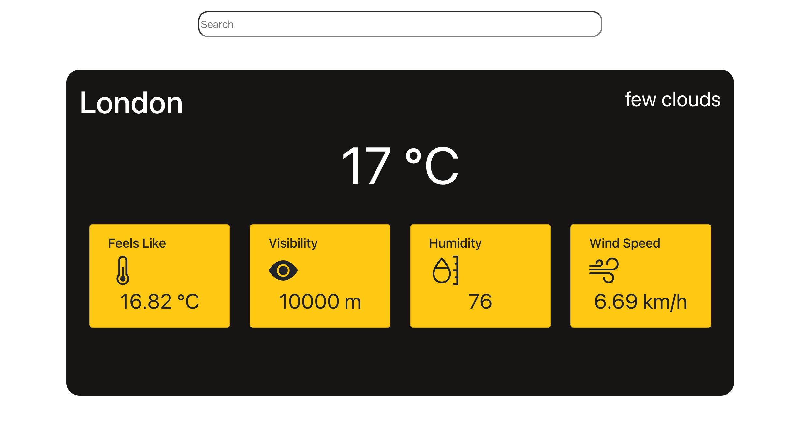
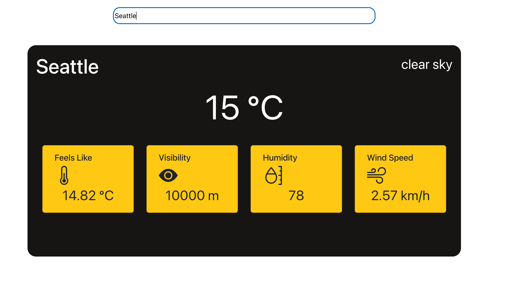

# Weather App

## About this weather app

Created with ReactJS and uses Fetch API to fetch weather data from a third party API. The data was integrated to show the temperature, wind speed, visibility and humidity of the city the user typed in.

## Used

Bootstrap, ReactJS: useState hook, Fetch API, useEffect hook

## How it works
The web app will show the weather data for London when first opened.
User can then type in  the search bar and press enter to get the data of the city they typed in.

Upon opening

After searching for a city

## Live Demo: (https://myatik.github.io/weather-app/)